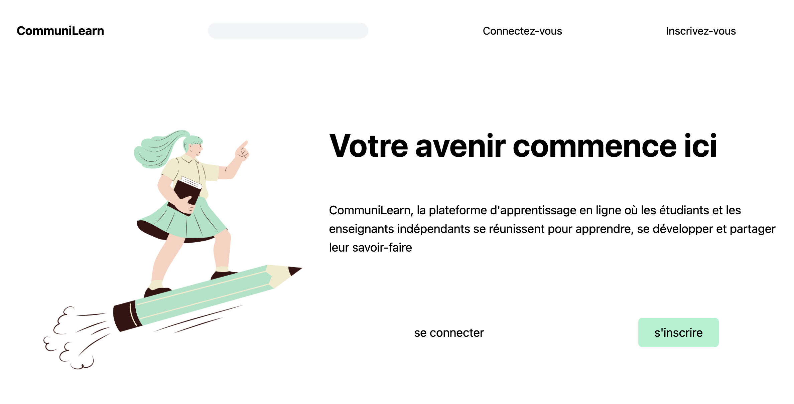

# Communilearn

Live site : [CommuniLearn](https://communilearn.onrender.com/)

An online teaching platform that connects freelance teachers and students, providing a flexible and accessible learning environment for individuals of all backgrounds. Students can browse and enroll in various courses, interact with teachers and peers, and track their progress. Freelance teachers can showcase their expertise, create and manage courses, and receive payment for their services, expanding their reach and growing their teaching business.

## Acknowledgements

 - [Fullstack open](https://fullstackopen.com/)
 - [How to Upload Images to Cloudinary With a React App](https://medium.com/geekculture/how-to-upload-images-to-cloudinary-with-a-react-app-f0dcc357999c)

## Made with

- React
- Node and Express
- React Router

**React** was chosen for the front-end of the MVP due to its component-based architecture, which enables reusable and modular code. It provides a fast and interactive user interface, facilitating a seamless learning experience. 

**Node.js** with **Express** was selected for the back-end due to its efficiency in handling server-side operations and its compatibility with JavaScript, allowing for easier code sharing between the front-end and back-end. 

This combination ensures a unified development stack and smooth communication between the client and server, enabling efficient data retrieval and storage.

## Optimizations

- Accessibility
- Ability to add images and videos 
- Ability to personalize profile 
- Filter and categories for lessons
- Ability to combine the lessons into courses

## Lessons Learned

While building this project, I learned the importance of proper deployment practices and faced challenges in deploying the application effectively. I initially attempted to integrate Redux but decided to switch to a simpler state management approach. Planning the design and functionalities beforehand proved beneficial as it provided a clear roadmap for coding, resulting in a smoother development process.

